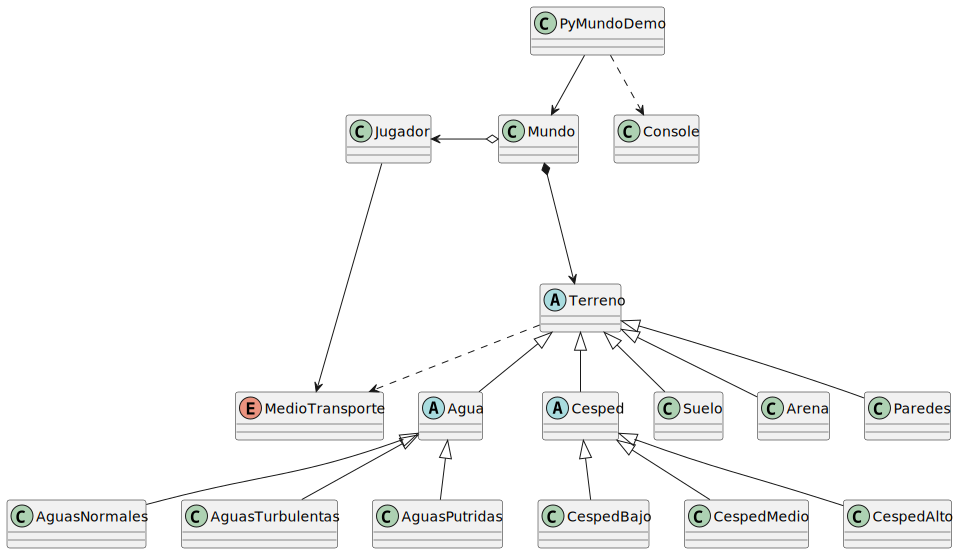

# Mundillo

Un mundo de juego con tipos de terreno heterogéneos. El jugador navega un mapa usando distintos medios de transporte; cada terreno define qué medios puede recorrerlo.

[Tipos de terreno](MapaTerreno.md)

<div align=center>



</div>

## El contrato

```java
public abstract class Terreno {
    public abstract boolean puedeSerRecorridoPor(MedioTransporte medio);
    public boolean esTransitable() { ... }
    public double obtenerFactorVelocidad() { ... }
}
```

`Terreno` define el contrato. Cualquier subtipo debe poder sustituirlo sin que el cliente lo note.

## El cliente

```java
Terreno terrenoDestino = mapa[nuevaY][nuevaX];

if (terrenoDestino.esTransitable() && terrenoDestino.puedeSerRecorridoPor(jugador.getMedioTransporte())) {
    double velocidad = terrenoDestino.obtenerFactorVelocidad() * jugador.getVelocidadBase();
    jugador.mover(nuevaX, nuevaY, velocidad);
}
```

`Mundo` trabaja exclusivamente con la abstracción `Terreno`. Sin `instanceof`. Sin conocimiento de los subtipos concretos. Cualquier `Terreno` es sustituible aquí sin modificar este código.

## El problema

Llega el momento de añadir nuevos tipos de terreno. Dos propuestas de diseño:

```java
// Opción A: aguas con navegabilidad variable
public class AguasPutridas extends Agua {
    private boolean navegable;

    public AguasPutridas() {
        super('~', "VERDE_PANTANO", 0.4);
        this.navegable = Math.random() > 0.5;
    }

    @Override
    public boolean puedeSerRecorridoPor(MedioTransporte medio) {
        return (medio == MedioTransporte.BOTE) ? navegable : false;
    }
}
```

```java
// Opción B: aguas que permiten cualquier medio de transporte
public class AguasRapidas extends AguasNormales {
    @Override
    public boolean puedeSerRecorridoPor(MedioTransporte medio) {
        return true;
    }
}
```

Ambas compilan. Ambas funcionan en el sentido de que el juego arranca. ¿Hay algún problema?

## *#2Think*

- ¿Qué asume el cliente (`Mundo`) sobre el comportamiento de `puedeSerRecorridoPor()`? ¿Lo cumplen `AguasPutridas` y `AguasRapidas`?
- Si la respuesta es que hay un problema, ¿cómo lo resolverías?
- `CespedAlto` restringe lo que `Cesped` permitía. ¿Es el mismo tipo de problema?

---

## Ramas

| Rama | Pregunta |
| --- | --- |
| `violacionLiskov` | ¿Qué está exactamente roto y por qué? |
| `propuesta001` | Una primera propuesta. ¿Resuelve el problema? ¿Del todo? |
| `propuesta002` | Una segunda propuesta. ¿Qué mejora respecto a la anterior? |
| `propuesta002-ampliada` | ¿Funciona realmente? Demuéstralo. |
